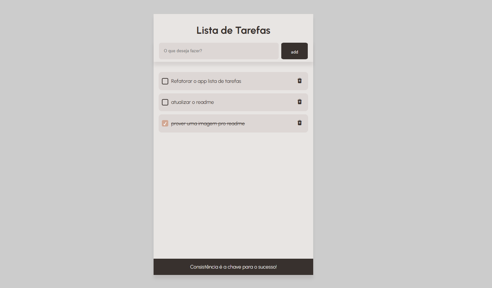

# Lista de tarefas

Este foi o meu primeiro projeto para acompanhar um curso de html e CSS. Apesar de muito simples, ele foi o meu primeiro contato com estas tecnologias. É verdade que eu precisei atualizar algumas coisinhas, mas todo o histórico de commits está disponível, para o meu constrangimento.

## Uso

### Requisitos

Não há nenhum requerimento pra rodar este app. Basta abrir o index.html no navegador.

### Instalação

Sem necessidade de instalação. Depois de baixar o projeto, basta abrir o arquivo "index.html" na pasta raiz.

## Construído com

## Autor

[Mayko Costa](https://github.com/Maykopr)

## Licensa

This project is licensed under the Creative Commons License
